# 02 - Database Design

| Field | Value |
| --- | --- |
| Document owner | Agent 1 - Architect / Tech Lead |
| Status | Baseline (implementation-ready) |
| Version | 1.0 |
| Source-of-truth rank | 6 |
| Engine | PostgreSQL 16 |
| Migrations | Alembic |

This document is the authoritative relational model. Agent 2 implements it exactly; deviations
require a change-protocol entry in this file. Where this document conflicts with
`docs/00_PRODUCT_SCOPE.md` or `docs/04_BUSINESS_RULES.md`, those win.

---

## 1. Conventions

| Topic | Convention |
| --- | --- |
| Naming | `snake_case`; tables plural; join tables `a_b`; indexes `ix_<table>_<cols>`; unique `uq_...`; check `ck_...`; foreign keys `fk_...` |
| Primary keys | `uuid` with `DEFAULT gen_random_uuid()`, except append-only high-volume logs (`audit_logs`, `order_status_history`, `complaint_status_history`, `login_attempts`, `business_setting_history`, `leave_balance_ledger`... see note) which use `bigint GENERATED ALWAYS AS IDENTITY` for ordering efficiency |
| Timestamps | `timestamptz`, UTC semantics, `NOT NULL DEFAULT now()` where applicable. Never `timestamp without time zone` |
| Business dates | `date` interpreted in the business timezone (`docs/01_ARCHITECTURE.md` section 17) |
| Money | `numeric(14,2)`; rates `numeric(14,2)` or `numeric(14,4)` for hourly rates. Never floating point |
| Durations | integer seconds (`_seconds` columns) |
| Enumerations | `text` + `CHECK (col IN (...))` rather than native PostgreSQL `ENUM`, so adding a value is a normal migration that does not lock the type |
| Booleans | `NOT NULL DEFAULT false` unless tri-state is required |
| Soft delete | `deleted_at timestamptz NULL` only where history must survive (`files`); entities with lifecycle use an explicit `status` instead. Nothing is hard-deleted where audit or financial history depends on it |
| Optimistic locking | `version integer NOT NULL DEFAULT 1` on mutable business documents: `orders`, `leaves`, `tasks`, `task_assignments`, `complaints`, `attendance_corrections`, `advances`, `salary_records`, `payroll_runs`, `leave_balances`, `attendance_records` |
| Audit columns | `created_at`, `updated_at`, and `created_by`/`updated_by` (`uuid` FK to `users`) on business tables |
| Append-only tables | `audit_logs`, `employee_ledger_entries`, `leave_balance_ledger`, `order_status_history`, `complaint_status_history`, `attendance_events`, `domain_events`. Application code performs `INSERT` and `SELECT` only; corrections are new rows |
| Derived values | Denormalized derived columns (e.g. `attendance_records.worked_seconds`) are allowed and must be recomputable from source rows; each such table documents its recomputation source |
| Cascades | `ON DELETE RESTRICT` by default. `CASCADE` only for true composition (e.g. `task_attachments` when a task is removed, which in practice never happens). Deleting users/employees is forbidden by design |

Note on the primary-key choice: `bigint` identity is used only where rows are append-only,
ordered by time, and never referenced by the API as an external identifier. Everything the API
exposes by id uses `uuid`, so identifiers are not enumerable.

---

## 2. Entity Inventory and Deliberate Additions

`agent-prompts/01_architect.md` requires that tables not be created merely because they were
listed. The model below is the coherent normalized result; the following additions to (and
splits of) the suggested list are deliberate and justified.

| Addition / change | Justification |
| --- | --- |
| `attendance_events` separate from `attendance_records` | Records are derived day state; events are the append-only source of truth for every punch. Required to recompute, to audit corrections, and to answer "what actually happened" |
| `attendance_sessions` (work intervals) | Required to compute worked duration correctly across multiple in/out cycles in a day and to enforce a single open session per employee |
| `attendance_verifications` | The product requires retention of verification evidence (timestamp, coordinates, accuracy, method, result, reason) without turning `attendance_events` into a polymorphic evidence dump |
| `attendance_qr_tokens` | Dynamic QR requires issued tokens, expiry, single-use consumption and replay detection |
| `attendance_corrections` | Missing/incorrect punches must be correctable with a reason, an approver and an audit trail; not expressible as an event alone |
| `break_types` | Break policy is configurable (which breaks exist, which are paid, maximum length) |
| `task_submissions` | Resubmission is an explicit workflow with attempt history; a single "submission" field on the assignment cannot represent attempts, decisions and evidence per attempt |
| `order_broadcasts` (rounds) | Re-broadcast after release/reassignment must be representable, and "who could see this order" must be answerable historically |
| `order_claims` | Claim ownership, release, expiry and revocation are lifecycle events that must be queryable and database-constrained (partial unique index) |
| `order_status_history` | The product requires previous status, new status, timestamp and actor for every meaningful transition |
| `leave_balance_ledger` | Balances must be explainable (accrual, usage, adjustment, carry-forward, reversal) and recomputable; a mutation counter alone is not auditable |
| `employee_compensation` | Compensation changes over time; a single rate column on `employees` would rewrite history and break payroll reproducibility |
| `payroll_runs` | Payroll computation, finalization and locking are period-level operations; needed for the payroll lock client decision (item 15) |
| `payroll_rule_snapshots` | `AGENTS.md` section 11 forbids deriving historical payroll from today's rules; snapshots preserve exactly what was used |
| `advance_installments` | Advance recovery scheduling must be explicit to compute per-period recovery and stop early on closure |
| `business_holidays` | Holiday classification and payroll working-day basis require a calendar; cannot be a hard-coded list |
| `complaint_categories`, `complaint_status_history` | Categories are configurable data (not code), and complaint lifecycle must be auditable |
| `notification_deliveries`, `notification_preferences`, `push_subscriptions` | Channel abstraction, per-user preferences and web-push delivery require their own state; the `notifications` row remains the in-app truth |
| `report_exports` | Export generation is asynchronous; artifacts need status, ownership and expiry |
| `domain_events`, `idempotency_keys`, `job_runs` | Technical platform tables supporting the outbox, duplicate-click protection and scheduler bookkeeping described in `docs/01_ARCHITECTURE.md` sections 9, 13.6 and 22 |
| `sessions`, `login_attempts`, `password_reset_tokens` | Server-side session strategy and authentication throttling |
| `files` | Single metadata table for all attachments; modules reference `file_id` rather than duplicating storage logic |

Entities evaluated and **not** created as separate tables, with reasons:

| Suggested entity | Decision |
| --- | --- |
| `roles`, `permissions`, `role_permissions` | Kept. Permissions are seeded from a code catalog (`docs/05_PERMISSIONS.md`) into rows so role composition is data, not code |
| `business_settings` | Kept, plus `business_setting_history` for rule-change auditability |
| `task_comments`, `task_attachments`, `order_attachments`, `complaint_comments` | Kept as concrete tables rather than a polymorphic `comments`/`attachments` table, so foreign keys and permissions stay explicit |
| `salary_records`, `employee_ledger`, `advances` | Kept (`employee_ledger_entries`, `salary_records`, `advances`), with `payroll_runs` added as the period container |
| `notifications` | Kept, with delivery/preference tables added |
| `audit_logs` | Kept as the single audit sink (security events included, categorized) rather than a separate `security_events` table |

---

## 3. Relationship Overview

```mermaid
erDiagram
  users ||--o| employees : "profile"
  users ||--o{ sessions : "has"
  users ||--o{ user_roles : "assigned"
  roles ||--o{ user_roles : "granted to"
  roles ||--o{ role_permissions : "contains"
  permissions ||--o{ role_permissions : "granted by"
  employees ||--o{ employee_compensation : "rate history"
  employees ||--o{ attendance_records : "daily"
  attendance_records ||--o{ attendance_events : "punches"
  attendance_records ||--o{ attendance_sessions : "work intervals"
  attendance_records ||--o{ break_sessions : "breaks"
  attendance_events ||--o{ attendance_verifications : "evidence"
  attendance_qr_tokens ||--o{ attendance_verifications : "qr used"
  attendance_records ||--o{ attendance_corrections : "corrections"
  tasks ||--o{ task_assignments : "assigned"
  task_assignments ||--o{ task_submissions : "attempts"
  tasks ||--o{ task_comments : "thread"
  orders ||--o{ order_broadcasts : "rounds"
  orders ||--o{ order_claims : "claims"
  orders ||--o{ order_status_history : "transitions"
  orders ||--o{ order_attachments : "proof"
  leave_types ||--o{ leaves : "typed by"
  employees ||--o{ leaves : "applies"
  employees ||--o{ leave_balances : "balance per year"
  leave_balances ||--o{ leave_balance_ledger : "movements"
  payroll_runs ||--o{ salary_records : "contains"
  employees ||--o{ salary_records : "paid"
  employees ||--o{ employee_ledger_entries : "ledger"
  employees ||--o{ advances : "takes"
  advances ||--o{ advance_installments : "schedule"
  complaints ||--o{ complaint_comments : "thread"
  complaints ||--o{ complaint_status_history : "transitions"
  users ||--o{ notifications : "receives"
  notifications ||--o{ notification_deliveries : "channels"
  users ||--o{ files : "uploads"
```

Cross-cutting reference convention: `files.id` is referenced by
`task_attachments.file_id`, `order_attachments.file_id`, `complaint_attachments.file_id`,
`leaves.attachment_file_id`, `attendance_corrections.attachment_file_id` and
`report_exports.file_id`.---

## 4. Identity Module

### 4.1 `users`

Authentication identity. One per human who can log in (Admin and every employee).

| Column | Type | Constraints / notes |
| --- | --- | --- |
| `id` | uuid | PK, default `gen_random_uuid()` |
| `username` | text | NOT NULL, UNIQUE, lower-case, immutable after creation |
| `email` | citext | NULL, UNIQUE (case-insensitive) |
| `password_hash` | text | NOT NULL, Argon2id encoded string |
| `status` | text | NOT NULL DEFAULT `'ACTIVE'`, CHECK in (`ACTIVE`,`DISABLED`,`LOCKED`) |
| `failed_login_count` | integer | NOT NULL DEFAULT 0, CHECK >= 0 |
| `locked_until` | timestamptz | NULL |
| `last_login_at` | timestamptz | NULL |
| `must_change_password` | boolean | NOT NULL DEFAULT false |
| `password_changed_at` | timestamptz | NULL |
| `created_at` / `updated_at` | timestamptz | NOT NULL DEFAULT now() |

Indexes: `uq_users_username`, `uq_users_email`, `ix_users_status`.

Rules: a `DISABLED` user cannot authenticate even with a valid password. `LOCKED` is temporary
and driven by `locked_until`. Passwords and hashes are never logged or returned by any API.

### 4.2 `sessions`

Server-side session store. Only a hash of the token is stored.

| Column | Type | Constraints / notes |
| --- | --- | --- |
| `id` | uuid | PK |
| `user_id` | uuid | NOT NULL, FK `users(id)` ON DELETE CASCADE |
| `token_hash` | char(64) | NOT NULL, UNIQUE (SHA-256 hex of the opaque token) |
| `csrf_token_hash` | char(64) | NOT NULL |
| `created_at` | timestamptz | NOT NULL DEFAULT now() |
| `last_seen_at` | timestamptz | NOT NULL DEFAULT now() |
| `expires_at` | timestamptz | NOT NULL (absolute lifetime) |
| `idle_expires_at` | timestamptz | NOT NULL (sliding idle timeout) |
| `revoked_at` | timestamptz | NULL |
| `revoked_reason` | text | NULL, CHECK in (`LOGOUT`,`PASSWORD_CHANGE`,`ADMIN_REVOKE`,`EMPLOYEE_DEACTIVATED`,`EXPIRED`,`SECURITY`) when present |
| `ip` | inet | NULL |
| `user_agent` | text | NULL |

Indexes: `uq_sessions_token_hash`, `ix_sessions_user_id`, `ix_sessions_expires_at`,
partial `ix_sessions_active` on (`user_id`) `WHERE revoked_at IS NULL`.

Active session = `revoked_at IS NULL AND expires_at > now() AND idle_expires_at > now()`.

### 4.3 `login_attempts`

Append-only authentication telemetry used for throttling and security review.

| Column | Type | Constraints / notes |
| --- | --- | --- |
| `id` | bigint identity | PK |
| `identifier` | text | NOT NULL (normalized submitted username/email) |
| `user_id` | uuid | NULL, FK `users(id)` when the identifier resolved |
| `succeeded` | boolean | NOT NULL |
| `failure_reason` | text | NULL, CHECK in (`BAD_CREDENTIALS`,`LOCKED`,`DISABLED`,`SESSION_EXPIRED`) |
| `ip` | inet | NULL |
| `user_agent` | text | NULL |
| `created_at` | timestamptz | NOT NULL DEFAULT now() |

Indexes: `ix_login_attempts_identifier_created_at` (`identifier`, `created_at DESC`),
`ix_login_attempts_user_created_at` (`user_id`, `created_at DESC`).

### 4.4 `password_reset_tokens`

Admin-initiated reset flow.

| Column | Type | Constraints / notes |
| --- | --- | --- |
| `id` | uuid | PK |
| `user_id` | uuid | NOT NULL, FK `users(id)` |
| `token_hash` | char(64) | NOT NULL, UNIQUE |
| `created_by` | uuid | NOT NULL, FK `users(id)` |
| `created_at` | timestamptz | NOT NULL DEFAULT now() |
| `expires_at` | timestamptz | NOT NULL |
| `used_at` | timestamptz | NULL |
| `reason` | text | NOT NULL |

Single-use: `used_at IS NULL` is required to consume; consumption sets `used_at` and
`must_change_password = true` on the user.

---

## 5. RBAC Module

### 5.1 `roles`

| Column | Type | Constraints / notes |
| --- | --- | --- |
| `id` | uuid | PK |
| `code` | text | NOT NULL, UNIQUE, `UPPER_SNAKE_CASE` (seeded: `ADMIN`, `EMPLOYEE`) |
| `name` | text | NOT NULL |
| `description` | text | NULL |
| `is_system` | boolean | NOT NULL DEFAULT false (system roles cannot be deleted) |
| `is_assignable` | boolean | NOT NULL DEFAULT true |
| `created_at` / `updated_at` | timestamptz | NOT NULL DEFAULT now() |

### 5.2 `permissions`

Seeded from the catalog in `docs/05_PERMISSIONS.md`. Rows exist so role composition is data.

| Column | Type | Constraints / notes |
| --- | --- | --- |
| `id` | uuid | PK |
| `code` | text | NOT NULL, UNIQUE (e.g. `attendance.correct.approve`) |
| `module` | text | NOT NULL (e.g. `attendance`) |
| `description` | text | NOT NULL |
| `is_sensitive` | boolean | NOT NULL DEFAULT false (financial/permission/audit capabilities) |

### 5.3 `role_permissions`

| Column | Type | Constraints / notes |
| --- | --- | --- |
| `role_id` | uuid | NOT NULL, FK `roles(id)` ON DELETE CASCADE |
| `permission_id` | uuid | NOT NULL, FK `permissions(id)` ON DELETE CASCADE |
| `granted_at` | timestamptz | NOT NULL DEFAULT now() |
| `granted_by` | uuid | NULL, FK `users(id)` |

PK (`role_id`, `permission_id`). Index `ix_role_permissions_permission_id`.

### 5.4 `user_roles`

| Column | Type | Constraints / notes |
| --- | --- | --- |
| `user_id` | uuid | NOT NULL, FK `users(id)` ON DELETE CASCADE |
| `role_id` | uuid | NOT NULL, FK `roles(id)` |
| `assigned_at` | timestamptz | NOT NULL DEFAULT now() |
| `assigned_by` | uuid | NULL, FK `users(id)` |

PK (`user_id`, `role_id`). Index `ix_user_roles_role_id`.

Effective permissions = union of permissions of all roles held by the user. Permission checks
resolve through this join; the result is cached per request only.

---

## 6. Directory Module

### 6.1 `employees`

| Column | Type | Constraints / notes |
| --- | --- | --- |
| `id` | uuid | PK |
| `user_id` | uuid | NOT NULL, UNIQUE, FK `users(id)` - one employee profile per login |
| `employee_code` | text | NOT NULL, UNIQUE (human-facing; also the default username) |
| `full_name` | text | NOT NULL |
| `phone` | text | NULL |
| `email` | text | NULL |
| `date_of_joining` | date | NOT NULL |
| `date_of_exit` | date | NULL |
| `employment_status` | text | NOT NULL DEFAULT `'ACTIVE'`, CHECK in (`ACTIVE`,`INACTIVE`,`SUSPENDED`,`EXITED`) |
| `employment_type` | text | NOT NULL DEFAULT `'FULL_TIME'`, CHECK in (`FULL_TIME`,`PART_TIME`,`CONTRACT`) |
| `department` | text | NULL |
| `designation` | text | NULL |
| `manager_employee_id` | uuid | NULL, FK `employees(id)`, CHECK `manager_employee_id <> id` |
| `emergency_contact_name` | text | NULL |
| `emergency_contact_phone` | text | NULL |
| `address_line` | text | NULL |
| `bank_account_name` | text | NULL (sensitive) |
| `bank_account_number` | text | NULL (sensitive; masked to last 4 in responses unless `employee.read.sensitive`) |
| `bank_ifsc` | text | NULL (sensitive) |
| `notes` | text | NULL |
| `created_at` / `updated_at` | timestamptz | NOT NULL DEFAULT now() |
| `created_by` | uuid | NULL, FK `users(id)` |

Indexes: `uq_employees_user_id`, `uq_employees_employee_code`, `ix_employees_status`,
`ix_employees_department`.

Rules: employees are never deleted. Leaving employment sets `employment_status = 'EXITED'`,
`date_of_exit`, and the `users.status = 'DISABLED'` in the same transaction. Historical
attendance, ledger and order records continue to reference the employee.

### 6.2 `employee_compensation`

Effective-dated compensation profile. Payroll resolves the rate valid for a business date, so
a rate change never rewrites history.

| Column | Type | Constraints / notes |
| --- | --- | --- |
| `id` | uuid | PK |
| `employee_id` | uuid | NOT NULL, FK `employees(id)` |
| `compensation_type` | text | NOT NULL, CHECK in (`FIXED_MONTHLY`,`DAILY_WAGE`,`HOURLY`) |
| `rate` | numeric(14,4) | NOT NULL, CHECK > 0 |
| `currency` | char(3) | NOT NULL |
| `effective_from` | date | NOT NULL |
| `effective_to` | date | NULL, CHECK `effective_to IS NULL OR effective_to >= effective_from` |
| `reason` | text | NOT NULL |
| `created_by` | uuid | NOT NULL, FK `users(id)` |
| `created_at` | timestamptz | NOT NULL DEFAULT now() |

Indexes: `ix_employee_compensation_employee_from` (`employee_id`, `effective_from DESC`).
Constraint: `EXCLUDE USING gist (employee_id WITH =, daterange(effective_from, COALESCE(effective_to, 'infinity'::date), '[]') WITH &&)`
(requires `btree_gist`) - no overlapping compensation periods per employee.

---

## 7. Settings Module

### 7.1 `business_settings`

Current value of each configurable business rule. One row per key.

| Column | Type | Constraints / notes |
| --- | --- | --- |
| `id` | uuid | PK |
| `key` | text | NOT NULL, UNIQUE, dotted (`attendance.geofence_radius_m`) |
| `value` | jsonb | NOT NULL (typed on read via the registry) |
| `value_type` | text | NOT NULL, CHECK in (`STRING`,`INT`,`DECIMAL`,`BOOL`,`JSON`,`TIME`,`TIMEZONE`,`DURATION_SECONDS`) |
| `description` | text | NOT NULL |
| `is_provisional` | boolean | NOT NULL DEFAULT false (true while the client decision is pending) |
| `version` | integer | NOT NULL DEFAULT 1, incremented on every change |
| `updated_by` | uuid | NULL, FK `users(id)` |
| `updated_at` | timestamptz | NOT NULL DEFAULT now() |
| `created_at` | timestamptz | NOT NULL DEFAULT now() |

### 7.2 `business_setting_history`

Append-only snapshot written on every settings change (rule-change auditability).

| Column | Type | Constraints / notes |
| --- | --- | --- |
| `id` | bigint identity | PK |
| `setting_key` | text | NOT NULL |
| `setting_version` | integer | NOT NULL |
| `old_value` | jsonb | NULL (null means the key was created) |
| `new_value` | jsonb | NOT NULL |
| `value_type` | text | NOT NULL |
| `changed_by` | uuid | NULL, FK `users(id)` (null only for system migration/conformance) |
| `reason` | text | NOT NULL |
| `changed_at` | timestamptz | NOT NULL DEFAULT now() |

Index: `ix_business_setting_history_key_changed_at` (`setting_key`, `changed_at DESC`).

Writes to both tables happen in one transaction with the settings service performing validation
against the code registry (`docs/04_BUSINESS_RULES.md` section 3). Keys not present in the
registry are rejected, so a typo cannot create a silently ignored rule.

---

## 8. Files Module

### 8.1 `files`

| Column | Type | Constraints / notes |
| --- | --- | --- |
| `id` | uuid | PK |
| `storage_key` | text | NOT NULL, UNIQUE (bucket-relative object key) |
| `original_name` | text | NOT NULL (metadata only; never used as a path) |
| `content_type` | text | NOT NULL (validated against `files.allowed_mime_types`) |
| `size_bytes` | bigint | NOT NULL, CHECK `size_bytes > 0` |
| `checksum_sha256` | char(64) | NOT NULL |
| `purpose` | text | NULL, CHECK in (`TASK_EVIDENCE`,`TASK_BRIEF`,`ORDER_PACKING_PROOF`,`ORDER_DELIVERY_PROOF`,`ORDER_CUSTOMER_CONFIRMATION`,`LEAVE_ATTACHMENT`,`COMPLAINT_EVIDENCE`,`ATTENDANCE_CORRECTION`,`PAYROLL_DOCUMENT`,`REPORT_EXPORT`) |
| `scan_status` | text | NOT NULL DEFAULT `'NOT_SCANNED'`, CHECK in (`NOT_SCANNED`,`CLEAN`,`INFECTED`,`FAILED`) |
| `uploaded_by` | uuid | NOT NULL, FK `users(id)` |
| `entity_type` | text | NULL (informational link, e.g. `task`) |
| `entity_id` | uuid | NULL |
| `deleted_at` | timestamptz | NULL (soft delete) |
| `created_at` | timestamptz | NOT NULL DEFAULT now() |

Indexes: `uq_files_storage_key`, `ix_files_uploaded_by`, `ix_files_entity` (`entity_type`,
`entity_id`), `ix_files_checksum`.

Access control is not encoded here: every download authorization is evaluated by the module
that owns the relying entity (`docs/01_ARCHITECTURE.md` section 14). `entity_type`/`entity_id`
is a denormalized convenience link and never the sole basis of an access decision.---

## 9. Attendance Module

### 9.1 `break_types`

| Column | Type | Constraints / notes |
| --- | --- | --- |
| `id` | uuid | PK |
| `code` | text | NOT NULL, UNIQUE (e.g. `LUNCH`, `TEA`) |
| `name` | text | NOT NULL |
| `is_paid` | boolean | NOT NULL DEFAULT false |
| `max_minutes` | integer | NULL, CHECK > 0 when present |
| `requires_approval` | boolean | NOT NULL DEFAULT false |
| `counts_toward_max_per_day` | boolean | NOT NULL DEFAULT true |
| `is_active` | boolean | NOT NULL DEFAULT true |
| `sort_order` | integer | NOT NULL DEFAULT 0 |
| `created_at` / `updated_at` | timestamptz | NOT NULL DEFAULT now() |

Seeded with an unpaid `LUNCH` type. Which break types exist is client decision 6; the table is
seeded provisionally and marked as such in `docs/04_BUSINESS_RULES.md` section 10.

### 9.2 `business_holidays`

| Column | Type | Constraints / notes |
| --- | --- | --- |
| `id` | uuid | PK |
| `holiday_date` | date | NOT NULL, UNIQUE |
| `name` | text | NOT NULL |
| `is_paid` | boolean | NOT NULL DEFAULT true |
| `is_working_day` | boolean | NOT NULL DEFAULT false (true = a special working day, e.g. a swapped shift) |
| `notes` | text | NULL |
| `created_by` | uuid | NULL, FK `users(id)` |
| `created_at` | timestamptz | NOT NULL DEFAULT now() |

Used for attendance day classification and for the `BUSINESS_CALENDAR` payroll working-day
basis. Weekly-off weekdays are a setting (`payroll.weekly_off_days`).

### 9.3 `attendance_records`

One row per employee per business date. Holds derived, recomputable day state.

| Column | Type | Constraints / notes |
| --- | --- | --- |
| `id` | uuid | PK |
| `employee_id` | uuid | NOT NULL, FK `employees(id)` |
| `business_date` | date | NOT NULL |
| `status` | text | NOT NULL DEFAULT `'NOT_MARKED'`, CHECK in (`NOT_MARKED`,`PRESENT`,`INCOMPLETE`,`ABSENT`,`ON_LEAVE`,`HOLIDAY`,`WEEKLY_OFF`) |
| `day_classification` | text | NOT NULL DEFAULT `'NONE'`, CHECK in (`FULL_DAY`,`HALF_DAY`,`PARTIAL_DAY`,`NONE`) |
| `first_check_in_at` | timestamptz | NULL |
| `last_check_out_at` | timestamptz | NULL |
| `worked_seconds` | integer | NOT NULL DEFAULT 0, CHECK >= 0 (sum of closed work sessions, minus unpaid breaks) |
| `break_seconds` | integer | NOT NULL DEFAULT 0, CHECK >= 0 (all breaks) |
| `unpaid_break_seconds` | integer | NOT NULL DEFAULT 0, CHECK >= 0 |
| `overtime_seconds` | integer | NOT NULL DEFAULT 0, CHECK >= 0 |
| `late_minutes` | integer | NOT NULL DEFAULT 0, CHECK >= 0 |
| `early_checkout_minutes` | integer | NOT NULL DEFAULT 0, CHECK >= 0 |
| `is_open` | boolean | NOT NULL DEFAULT false (true while a session is open) |
| `is_corrected` | boolean | NOT NULL DEFAULT false |
| `computation_version` | integer | NOT NULL DEFAULT 1 (bumped on every recomputation) |
| `settings_snapshot` | jsonb | NULL (settings used for the last computation) |
| `computed_at` | timestamptz | NULL |
| `notes` | text | NULL |
| `version` | integer | NOT NULL DEFAULT 1 |
| `created_at` / `updated_at` | timestamptz | NOT NULL DEFAULT now() |

Indexes: `uq_attendance_records_employee_date` (`employee_id`, `business_date`),
`ix_attendance_records_business_date`, `ix_attendance_records_status_date` (`status`,
`business_date`), partial `ix_attendance_records_open` (`employee_id`) `WHERE is_open`.

Recomputation source: closed `attendance_sessions` and `break_sessions` for this record.
`worked_seconds` must always equal the recomputed value; a mismatch is a defect (Agent 5
verifies this).

### 9.4 `attendance_events`

Append-only punch log. Never updated; corrections add new events and are linked to the
correction that authorized them.

| Column | Type | Constraints / notes |
| --- | --- | --- |
| `id` | uuid | PK |
| `attendance_record_id` | uuid | NOT NULL, FK `attendance_records(id)` |
| `employee_id` | uuid | NOT NULL, FK `employees(id)` |
| `event_type` | text | NOT NULL, CHECK in (`CHECK_IN`,`CHECK_OUT`,`BREAK_START`,`BREAK_END`,`CORRECTION`,`AUTO_CLOSE`) |
| `occurred_at` | timestamptz | NOT NULL (may differ from `created_at` for corrections) |
| `recorded_at` | timestamptz | NOT NULL DEFAULT now() |
| `business_date` | date | NOT NULL |
| `source` | text | NOT NULL, CHECK in (`WEB`,`MOBILE_WEB`,`PWA`,`ADMIN`,`SYSTEM`) |
| `actor_user_id` | uuid | NULL, FK `users(id)` |
| `break_type_id` | uuid | NULL, FK `break_types(id)` (required for break events) |
| `attendance_session_id` | uuid | NULL (linked once the session row exists) |
| `correction_id` | uuid | NULL, FK `attendance_corrections(id)` |
| `notes` | text | NULL |
| `created_at` | timestamptz | NOT NULL DEFAULT now() |

Indexes: `ix_attendance_events_record_occurred` (`attendance_record_id`, `occurred_at`),
`ix_attendance_events_employee_occurred` (`employee_id`, `occurred_at DESC`).
Constraint: `ck_attendance_events_break_type` - `break_type_id` is NOT NULL for
`BREAK_START`/`BREAK_END`, NULL otherwise.

### 9.5 `attendance_sessions`

Work intervals between a check-in and its matching check-out.

| Column | Type | Constraints / notes |
| --- | --- | --- |
| `id` | uuid | PK |
| `attendance_record_id` | uuid | NOT NULL, FK `attendance_records(id)` |
| `employee_id` | uuid | NOT NULL, FK `employees(id)` |
| `started_at` | timestamptz | NOT NULL |
| `started_event_id` | uuid | NOT NULL, FK `attendance_events(id)` |
| `ended_at` | timestamptz | NULL |
| `ended_event_id` | uuid | NULL, FK `attendance_events(id)` |
| `start_source` | text | NOT NULL, CHECK in (`WEB`,`MOBILE_WEB`,`PWA`,`ADMIN`,`SYSTEM`) |
| `end_source` | text | NULL, CHECK in (`WEB`,`MOBILE_WEB`,`PWA`,`ADMIN`,`SYSTEM`) |
| `close_reason` | text | NULL, CHECK in (`MANUAL`,`AUTO_CLOSE`,`CORRECTION`) |
| `duration_seconds` | integer | NULL, CHECK >= 0 when present |
| `is_open` | boolean | NOT NULL DEFAULT true |

Constraints: `CHECK ((ended_at IS NULL) = is_open)`,
`CHECK (ended_at IS NULL OR ended_at > started_at)`,
partial `uq_attendance_sessions_open_employee` on (`employee_id`) `WHERE is_open`
- **at most one open work session per employee**, which is what makes duplicate check-in
impossible at the database level.
Indexes: `ix_attendance_sessions_record` (`attendance_record_id`),
`ix_attendance_sessions_employee_started` (`employee_id`, `started_at DESC`).

### 9.6 `break_sessions`

| Column | Type | Constraints / notes |
| --- | --- | --- |
| `id` | uuid | PK |
| `attendance_record_id` | uuid | NOT NULL, FK `attendance_records(id)` |
| `attendance_session_id` | uuid | NULL, FK `attendance_sessions(id)` |
| `employee_id` | uuid | NOT NULL, FK `employees(id)` |
| `break_type_id` | uuid | NOT NULL, FK `break_types(id)` |
| `started_at` | timestamptz | NOT NULL |
| `start_event_id` | uuid | NOT NULL, FK `attendance_events(id)` |
| `ended_at` | timestamptz | NULL |
| `end_event_id` | uuid | NULL, FK `attendance_events(id)` |
| `duration_seconds` | integer | NULL, CHECK >= 0 when present |
| `is_paid` | boolean | NOT NULL (snapshot of the break type policy at break start) |
| `is_open` | boolean | NOT NULL DEFAULT true |
| `close_reason` | text | NULL, CHECK in (`MANUAL`,`AUTO_CLOSE`,`CORRECTION`) |
| `created_at` | timestamptz | NOT NULL DEFAULT now() |

Constraints: partial `uq_break_sessions_open_employee` on (`employee_id`) `WHERE is_open`;
`CHECK (ended_at IS NULL OR ended_at > started_at)`.
Index: `ix_break_sessions_record` (`attendance_record_id`).
`is_paid` is snapshotted so that changing a break type later cannot silently alter already
computed work hours.

### 9.7 `attendance_verifications`

Evidence for a verification attempt. One or more rows per attendance event (for example one
GPS row and one QR row when both methods are required).

| Column | Type | Constraints / notes |
| --- | --- | --- |
| `id` | uuid | PK |
| `attendance_event_id` | uuid | NOT NULL, FK `attendance_events(id)` |
| `employee_id` | uuid | NOT NULL, FK `employees(id)` |
| `method` | text | NOT NULL, CHECK in (`GPS`,`QR`,`GPS_AND_QR`,`MANUAL_OVERRIDE`,`NONE`) |
| `result` | text | NOT NULL, CHECK in (`PASSED`,`FAILED`,`PASSED_WITH_WARNING`) |
| `latitude` | numeric(9,6) | NULL, CHECK between -90 and 90 |
| `longitude` | numeric(9,6) | NULL, CHECK between -180 and 180 |
| `accuracy_meters` | numeric(8,2) | NULL, CHECK >= 0 |
| `distance_meters` | numeric(10,2) | NULL, CHECK >= 0 |
| `geofence_radius_meters` | numeric(8,2) | NULL (snapshot of the threshold applied) |
| `location_captured_at` | timestamptz | NULL (client-reported fix time, used for freshness checks) |
| `qr_token_id` | uuid | NULL, FK `attendance_qr_tokens(id)` |
| `qr_result` | text | NULL, CHECK in (`VALID`,`EXPIRED`,`REPLAYED`,`INVALID`) |
| `failure_code` | text | NULL, CHECK in (`LOCATION_UNAVAILABLE`,`LOCATION_STALE`,`ACCURACY_EXCEEDS_LIMIT`,`OUTSIDE_GEOFENCE`,`QR_MISSING`,`QR_EXPIRED`,`QR_REPLAYED`,`QR_INVALID`,`METHOD_NOT_ALLOWED`,`ATTENDANCE_STATE_INVALID`,`RATE_LIMITED`) |
| `failure_reason` | text | NULL (human-readable) |
| `raw_metadata` | jsonb | NULL (provider/browser metadata, redacted) |
| `created_at` | timestamptz | NOT NULL DEFAULT now() |

Indexes: `ix_attendance_verifications_event` (`attendance_event_id`),
`ix_attendance_verifications_employee_created` (`employee_id`, `created_at DESC`),
`ix_attendance_verifications_qr_token` (`qr_token_id`).

### 9.8 `attendance_qr_tokens`

Dynamic shop QR tokens. Only the hash is stored, so a database read cannot reproduce a scannable
code.

| Column | Type | Constraints / notes |
| --- | --- | --- |
| `id` | uuid | PK |
| `token_hash` | char(64) | NOT NULL, UNIQUE (SHA-256 of the token payload) |
| `nonce` | text | NOT NULL (public part embedded in the QR, used for lookup) |
| `purpose` | text | NOT NULL DEFAULT `'SHOP_CHECKIN'`, CHECK in (`SHOP_CHECKIN`,`SHOP_CHECKOUT`) |
| `issued_by` | uuid | NOT NULL, FK `users(id)` |
| `issued_at` | timestamptz | NOT NULL DEFAULT now() |
| `expires_at` | timestamptz | NOT NULL, CHECK `expires_at > issued_at` |
| `consumed_at` | timestamptz | NULL |
| `consumed_by_employee_id` | uuid | NULL, FK `employees(id)` |
| `consumed_event_id` | uuid | NULL, FK `attendance_events(id)` |
| `is_revoked` | boolean | NOT NULL DEFAULT false |

Indexes: `uq_attendance_qr_tokens_token_hash`, `uq_attendance_qr_tokens_nonce`,
`ix_attendance_qr_tokens_expires_at`.

Single-use by default (`attendance.qr_single_use`): consumption is an atomic conditional
`UPDATE ... SET consumed_at = now() WHERE id = :id AND consumed_at IS NULL AND expires_at > now()`;
zero rows affected means replay or expiry and is recorded with the matching `qr_result`.

### 9.9 `attendance_corrections`

| Column | Type | Constraints / notes |
| --- | --- | --- |
| `id` | uuid | PK |
| `attendance_record_id` | uuid | NOT NULL, FK `attendance_records(id)` |
| `employee_id` | uuid | NOT NULL, FK `employees(id)` |
| `correction_type` | text | NOT NULL, CHECK in (`MISSED_CHECK_IN`,`MISSED_CHECK_OUT`,`MISSED_BREAK`,`WRONG_TIME`,`WRONG_CLASSIFICATION`,`OTHER`) |
| `requested_by` | uuid | NOT NULL, FK `users(id)` |
| `requested_at` | timestamptz | NOT NULL DEFAULT now() |
| `requested_check_in_at` | timestamptz | NULL |
| `requested_check_out_at` | timestamptz | NULL |
| `requested_break_start_at` | timestamptz | NULL |
| `requested_break_end_at` | timestamptz | NULL |
| `requested_notes` | text | NULL |
| `reason` | text | NOT NULL |
| `attachment_file_id` | uuid | NULL, FK `files(id)` |
| `status` | text | NOT NULL DEFAULT `'PENDING'`, CHECK in (`PENDING`,`APPROVED`,`REJECTED`,`CANCELLED`) |
| `decided_by` | uuid | NULL, FK `users(id)` |
| `decided_at` | timestamptz | NULL |
| `decision_notes` | text | NULL |
| `applied_event_id` | uuid | NULL, FK `attendance_events(id)` (the CORRECTION event created on approval) |
| `previous_computation` | jsonb | NULL (derived values before the correction was applied) |
| `version` | integer | NOT NULL DEFAULT 1 |
| `created_at` / `updated_at` | timestamptz | NOT NULL DEFAULT now() |

Constraints: `CHECK (status <> 'APPROVED' OR (decided_by IS NOT NULL AND decided_at IS NOT NULL))`,
`CHECK (requested_check_out_at IS NULL OR requested_check_in_at IS NULL OR requested_check_out_at > requested_check_in_at)`.
Indexes: `ix_attendance_corrections_status_requested` (`status`, `requested_at`),
`ix_attendance_corrections_employee` (`employee_id`, `requested_at DESC`),
`ix_attendance_corrections_record` (`attendance_record_id`).

---

## 10. Tasks Module

### 10.1 `tasks`

| Column | Type | Constraints / notes |
| --- | --- | --- |
| `id` | uuid | PK |
| `title` | text | NOT NULL, length 1..200 |
| `description` | text | NULL |
| `priority` | text | NOT NULL DEFAULT `'NORMAL'`, CHECK in (`LOW`,`NORMAL`,`HIGH`,`URGENT`) |
| `status` | text | NOT NULL DEFAULT `'ASSIGNED'`, CHECK in (`ASSIGNED`,`IN_PROGRESS`,`SUBMITTED`,`COMPLETED`,`CANCELLED`) - denormalized rollup of assignments |
| `created_by` | uuid | NOT NULL, FK `users(id)` |
| `due_at` | timestamptz | NULL |
| `requires_evidence` | boolean | NOT NULL DEFAULT true |
| `requires_attachment` | boolean | NOT NULL DEFAULT false |
| `completed_at` | timestamptz | NULL |
| `cancelled_at` | timestamptz | NULL |
| `cancel_reason` | text | NULL |
| `version` | integer | NOT NULL DEFAULT 1 |
| `created_at` / `updated_at` | timestamptz | NOT NULL DEFAULT now() |

Indexes: `ix_tasks_status_due` (`status`, `due_at`), `ix_tasks_created_by`, `ix_tasks_priority`.
`tasks.status` is derived from its assignments (`docs/04_BUSINESS_RULES.md` section 4.6) and is
maintained by the tasks service inside the same transaction.

### 10.2 `task_assignments`

| Column | Type | Constraints / notes |
| --- | --- | --- |
| `id` | uuid | PK |
| `task_id` | uuid | NOT NULL, FK `tasks(id)` |
| `employee_id` | uuid | NOT NULL, FK `employees(id)` |
| `assigned_by` | uuid | NOT NULL, FK `users(id)` |
| `assigned_at` | timestamptz | NOT NULL DEFAULT now() |
| `status` | text | NOT NULL DEFAULT `'ASSIGNED'`, CHECK in (`ASSIGNED`,`STARTED`,`SUBMITTED`,`APPROVED`,`REJECTED`,`RESUBMISSION_REQUESTED`,`CANCELLED`) |
| `started_at` | timestamptz | NULL |
| `completed_at` | timestamptz | NULL (employee marked work complete) |
| `submitted_at` | timestamptz | NULL (latest submission) |
| `reviewed_at` | timestamptz | NULL |
| `reviewer_id` | uuid | NULL, FK `users(id)` |
| `review_decision` | text | NULL, CHECK in (`APPROVED`,`REJECTED`,`RESUBMISSION_REQUESTED`) |
| `review_notes` | text | NULL |
| `attempt_count` | integer | NOT NULL DEFAULT 0, CHECK >= 0 |
| `due_at` | timestamptz | NULL (assignment-level override) |
| `version` | integer | NOT NULL DEFAULT 1 |
| `created_at` / `updated_at` | timestamptz | NOT NULL DEFAULT now() |

Indexes: `uq_task_assignments_task_employee` (`task_id`, `employee_id`),
`ix_task_assignments_employee_status` (`employee_id`, `status`),
`ix_task_assignments_status_due` (`status`, `due_at`).
Constraint: `CHECK (status IN ('APPROVED','REJECTED','RESUBMISSION_REQUESTED') = (review_decision IS NOT NULL))`
(every reviewed state carries a decision; unreviewed states carry none).

### 10.3 `task_submissions`

One row per submission attempt, preserving the full history including rejections.

| Column | Type | Constraints / notes |
| --- | --- | --- |
| `id` | uuid | PK |
| `assignment_id` | uuid | NOT NULL, FK `task_assignments(id)` |
| `attempt_no` | integer | NOT NULL, CHECK >= 1 |
| `description` | text | NULL |
| `submitted_by` | uuid | NOT NULL, FK `users(id)` |
| `submitted_at` | timestamptz | NOT NULL DEFAULT now() |
| `decision` | text | NULL, CHECK in (`APPROVED`,`REJECTED`,`RESUBMISSION_REQUESTED`) |
| `decided_by` | uuid | NULL, FK `users(id)` |
| `decided_at` | timestamptz | NULL |
| `decision_notes` | text | NULL |
| `created_at` | timestamptz | NOT NULL DEFAULT now() |

Indexes: `uq_task_submissions_assignment_attempt` (`assignment_id`, `attempt_no`),
`ix_task_submissions_assignment` (`assignment_id`, `attempt_no DESC`).
Constraint: `CHECK (decision IS NULL OR (decided_by IS NOT NULL AND decided_at IS NOT NULL))`.

### 10.4 `task_comments`

| Column | Type | Constraints / notes |
| --- | --- | --- |
| `id` | uuid | PK |
| `task_id` | uuid | NOT NULL, FK `tasks(id)` |
| `assignment_id` | uuid | NULL, FK `task_assignments(id)` |
| `author_user_id` | uuid | NOT NULL, FK `users(id)` |
| `body` | text | NOT NULL, length 1..4000 |
| `is_internal` | boolean | NOT NULL DEFAULT false (admin-only note) |
| `created_at` | timestamptz | NOT NULL DEFAULT now() |

Index: `ix_task_comments_task_created` (`task_id`, `created_at`). Comments are not editable;
corrections are new comments (keeps history honest and avoids edit-audit complexity).

### 10.5 `task_attachments`

| Column | Type | Constraints / notes |
| --- | --- | --- |
| `id` | uuid | PK |
| `task_id` | uuid | NOT NULL, FK `tasks(id)` |
| `assignment_id` | uuid | NULL, FK `task_assignments(id)` |
| `submission_id` | uuid | NULL, FK `task_submissions(id)` |
| `file_id` | uuid | NOT NULL, UNIQUE, FK `files(id)` |
| `attachment_type` | text | NOT NULL, CHECK in (`BRIEF`,`EVIDENCE`,`OTHER`) |
| `created_by` | uuid | NOT NULL, FK `users(id)` |
| `created_at` | timestamptz | NOT NULL DEFAULT now() |

Index: `ix_task_attachments_task` (`task_id`), `ix_task_attachments_submission`
(`submission_id`). `BRIEF` attachments are admin-provided; `EVIDENCE` attachments belong to a
submission (enforced in the service: evidence requires `submission_id`).

---

## 11. Orders Module

### 11.1 `orders`

| Column | Type | Constraints / notes |
| --- | --- | --- |
| `id` | uuid | PK |
| `order_code` | text | NOT NULL, UNIQUE (human-facing) |
| `customer_name` | text | NOT NULL |
| `customer_phone` | text | NULL |
| `delivery_address` | text | NULL |
| `delivery_notes` | text | NULL |
| `item_summary` | text | NULL |
| `item_count` | integer | NULL, CHECK >= 0 |
| `order_amount` | numeric(14,2) | NOT NULL DEFAULT 0, CHECK >= 0 |
| `currency` | char(3) | NOT NULL |
| `payment_mode` | text | NULL, CHECK in (`PREPAID`,`COD`,`OTHER`) |
| `status` | text | NOT NULL DEFAULT `'BROADCASTED'`, CHECK in (`BROADCASTED`,`CLAIMED`,`PACKING`,`PACKED`,`READY_FOR_DELIVERY`,`OUT_FOR_DELIVERY`,`DELIVERED`,`CANCELLED`,`FAILED`,`REASSIGNED`) |
| `created_by` | uuid | NOT NULL, FK `users(id)` |
| `broadcast_at` | timestamptz | NULL |
| `current_assignee_id` | uuid | NULL, FK `employees(id)` |
| `claimed_at` | timestamptz | NULL |
| `claim_expires_at` | timestamptz | NULL |
| `packed_at` / `ready_at` / `dispatched_at` / `delivered_at` | timestamptz | NULL |
| `cancelled_at` | timestamptz | NULL |
| `cancel_reason` | text | NULL |
| `failed_at` | timestamptz | NULL |
| `failure_reason` | text | NULL |
| `reassigned_at` | timestamptz | NULL |
| `reassign_count` | integer | NOT NULL DEFAULT 0, CHECK >= 0 |
| `pod_required` | boolean | NOT NULL (snapshot of the policy at broadcast time) |
| `notes` | text | NULL |
| `version` | integer | NOT NULL DEFAULT 1 |
| `created_at` / `updated_at` | timestamptz | NOT NULL DEFAULT now() |

Indexes: `uq_orders_order_code`, `ix_orders_status_broadcast` (`status`, `broadcast_at`),
`ix_orders_assignee_status` (`current_assignee_id`, `status`),
`ix_orders_created_at`, `ix_orders_claim_expires_at` (partial, `WHERE claim_expires_at IS NOT NULL`).

Consistency constraints:

- `ck_orders_assignee_presence`: `current_assignee_id IS NOT NULL` for statuses in
  (`CLAIMED`,`PACKING`,`PACKED`,`READY_FOR_DELIVERY`,`OUT_FOR_DELIVERY`,`DELIVERED`), and
  `current_assignee_id IS NULL` for (`BROADCASTED`,`REASSIGNED`).
  `CANCELLED`/`FAILED` may retain the last assignee for history.
- `ck_orders_delivered_timestamp`: status `DELIVERED` requires `delivered_at IS NOT NULL`.
- `ck_orders_cancelled_reason`: status `CANCELLED` requires `cancel_reason IS NOT NULL`.

### 11.2 `order_broadcasts`

One row per broadcast round, so re-broadcast and audience are historically answerable.

| Column | Type | Constraints / notes |
| --- | --- | --- |
| `id` | uuid | PK |
| `order_id` | uuid | NOT NULL, FK `orders(id)` |
| `round_no` | integer | NOT NULL, CHECK >= 1 |
| `broadcast_by` | uuid | NOT NULL, FK `users(id)` |
| `broadcast_at` | timestamptz | NOT NULL DEFAULT now() |
| `audience_scope` | text | NOT NULL, CHECK in (`ALL_ACTIVE_EMPLOYEES`,`ROLE`,`EXPLICIT`) |
| `audience_payload` | jsonb | NULL (role codes or employee ids for non-`ALL` scopes) |
| `expires_at` | timestamptz | NULL |
| `is_active` | boolean | NOT NULL DEFAULT true |

Indexes: `uq_order_broadcasts_order_round` (`order_id`, `round_no`),
partial `uq_order_broadcasts_active_order` on (`order_id`) `WHERE is_active`.

### 11.3 `order_claims`

| Column | Type | Constraints / notes |
| --- | --- | --- |
| `id` | uuid | PK |
| `order_id` | uuid | NOT NULL, FK `orders(id)` |
| `employee_id` | uuid | NOT NULL, FK `employees(id)` |
| `order_broadcast_id` | uuid | NULL, FK `order_broadcasts(id)` |
| `status` | text | NOT NULL DEFAULT `'ACTIVE'`, CHECK in (`ACTIVE`,`COMPLETED`,`RELEASED`,`REVOKED`,`EXPIRED`) |
| `claimed_at` | timestamptz | NOT NULL DEFAULT now() |
| `claim_expires_at` | timestamptz | NULL |
| `ended_at` | timestamptz | NULL |
| `ended_by` | uuid | NULL, FK `users(id)` |
| `end_reason` | text | NULL, CHECK in (`DELIVERED`,`FAILED`,`RELEASED_BY_EMPLOYEE`,`REVOKED_BY_ADMIN`,`EXPIRED`,`REASSIGNED`,`CANCELLED`) |
| `created_at` | timestamptz | NOT NULL DEFAULT now() |

Indexes: partial UNIQUE `uq_order_claims_active_order` on (`order_id`) `WHERE status = 'ACTIVE'`
- **the database guarantee that an order has at most one active claim**; partial
`ix_order_claims_active_employee` on (`employee_id`, `claimed_at DESC`) `WHERE status = 'ACTIVE'`;
`ix_order_claims_expiry` (`status`, `claim_expires_at`).
Constraint: `CHECK (status = 'ACTIVE' OR ended_at IS NOT NULL)`.

### 11.4 `order_status_history`

Append-only transition log; supports the "timestamp, actor, previous status, new status"
requirement and SLA/report metrics.

| Column | Type | Constraints / notes |
| --- | --- | --- |
| `id` | bigint identity | PK |
| `order_id` | uuid | NOT NULL, FK `orders(id)` |
| `from_status` | text | NULL (null for the initial broadcast) |
| `to_status` | text | NOT NULL |
| `changed_by` | uuid | NULL, FK `users(id)` (null for system/sweeper transitions) |
| `actor_type` | text | NOT NULL DEFAULT `'USER'`, CHECK in (`USER`,`SYSTEM`) |
| `employee_id` | uuid | NULL, FK `employees(id)` (assignee at the time of transition) |
| `reason` | text | NULL |
| `metadata` | jsonb | NULL |
| `changed_at` | timestamptz | NOT NULL DEFAULT now() |

Indexes: `ix_order_status_history_order_changed` (`order_id`, `changed_at`),
`ix_order_status_history_to_status_changed` (`to_status`, `changed_at`).

### 11.5 `order_attachments`

| Column | Type | Constraints / notes |
| --- | --- | --- |
| `id` | uuid | PK |
| `order_id` | uuid | NOT NULL, FK `orders(id)` |
| `file_id` | uuid | NOT NULL, UNIQUE, FK `files(id)` |
| `purpose` | text | NOT NULL, CHECK in (`PACKING_PROOF`,`DELIVERY_PROOF`,`CUSTOMER_CONFIRMATION`,`OTHER`) |
| `uploaded_by` | uuid | NOT NULL, FK `users(id)` |
| `uploaded_at` | timestamptz | NOT NULL DEFAULT now() |
| `note` | text | NULL |
| `latitude` / `longitude` | numeric(9,6) | NULL (optional proof-of-delivery location evidence) |
| `accuracy_meters` | numeric(8,2) | NULL |
| `customer_confirmed_at` | timestamptz | NULL |
| `customer_confirmation_method` | text | NULL, CHECK in (`SIGNATURE`,`OTP`,`VERBAL`,`PHOTO`,`APP`) |

Index: `ix_order_attachments_order_purpose` (`order_id`, `purpose`).---

## 12. Leaves Module

### 12.1 `leave_types`

| Column | Type | Constraints / notes |
| --- | --- | --- |
| `id` | uuid | PK |
| `code` | text | NOT NULL, UNIQUE |
| `name` | text | NOT NULL |
| `is_paid` | boolean | NOT NULL DEFAULT true |
| `requires_approval` | boolean | NOT NULL DEFAULT true |
| `requires_attachment_after_days` | integer | NULL, CHECK > 0 when present |
| `max_consecutive_days` | integer | NULL, CHECK > 0 when present |
| `allow_half_day` | boolean | NOT NULL DEFAULT false |
| `annual_entitlement_days` | numeric(6,2) | NULL, CHECK >= 0 when present |
| `accrual_mode` | text | NULL, CHECK in (`ANNUAL_UPFRONT`,`MONTHLY_ACCRUAL`,`MANUAL`) |
| `is_active` | boolean | NOT NULL DEFAULT true |
| `sort_order` | integer | NOT NULL DEFAULT 0 |
| `created_at` / `updated_at` | timestamptz | NOT NULL DEFAULT now() |

Leave types and their balances are client decision 12. The table is seeded with provisional
types (`CASUAL`, `SICK`, `UNPAID`) and `annual_entitlement_days` left NULL until confirmed, so
no invented policy is enforced silently.

### 12.2 `leaves`

| Column | Type | Constraints / notes |
| --- | --- | --- |
| `id` | uuid | PK |
| `employee_id` | uuid | NOT NULL, FK `employees(id)` |
| `leave_type_id` | uuid | NOT NULL, FK `leave_types(id)` |
| `start_date` | date | NOT NULL |
| `end_date` | date | NOT NULL |
| `total_days` | numeric(6,2) | NOT NULL, CHECK > 0 |
| `is_half_day` | boolean | NOT NULL DEFAULT false |
| `half_day_period` | text | NULL, CHECK in (`FIRST_HALF`,`SECOND_HALF`) |
| `reason` | text | NOT NULL |
| `attachment_file_id` | uuid | NULL, FK `files(id)` |
| `status` | text | NOT NULL DEFAULT `'PENDING'`, CHECK in (`PENDING`,`APPROVED`,`REJECTED`,`CANCELLED`,`MODIFICATION_REQUESTED`) |
| `applied_at` | timestamptz | NOT NULL DEFAULT now() |
| `decided_by` | uuid | NULL, FK `users(id)` |
| `decided_at` | timestamptz | NULL |
| `decision_notes` | text | NULL |
| `cancelled_at` | timestamptz | NULL |
| `cancel_reason` | text | NULL |
| `balance_pending_hold_applied` | boolean | NOT NULL DEFAULT false |
| `balance_usage_applied` | boolean | NOT NULL DEFAULT false |
| `version` | integer | NOT NULL DEFAULT 1 |
| `created_at` / `updated_at` | timestamptz | NOT NULL DEFAULT now() |

Constraints:

- `CHECK (end_date >= start_date)`
- `CHECK ((is_half_day = false AND half_day_period IS NULL) OR (is_half_day = true AND half_day_period IS NOT NULL AND start_date = end_date))`
- `CHECK (status <> 'APPROVED' OR (decided_by IS NOT NULL AND decided_at IS NOT NULL))`
- Overlap prevention (requires `btree_gist`):
  `EXCLUDE USING gist (employee_id WITH =, daterange(start_date, end_date, '[]') WITH &&) WHERE (status IN ('PENDING','APPROVED'))`
  - two active leave requests for the same employee may never overlap in date range.

Indexes: `ix_leaves_employee_start` (`employee_id`, `start_date DESC`),
`ix_leaves_status_applied` (`status`, `applied_at`), `ix_leaves_type_start`
(`leave_type_id`, `start_date`).

### 12.3 `leave_balances`

| Column | Type | Constraints / notes |
| --- | --- | --- |
| `id` | uuid | PK |
| `employee_id` | uuid | NOT NULL, FK `employees(id)` |
| `leave_type_id` | uuid | NOT NULL, FK `leave_types(id)` |
| `period_year` | integer | NOT NULL, CHECK between 2000 and 2200 |
| `entitled_days` | numeric(6,2) | NOT NULL DEFAULT 0, CHECK >= 0 |
| `accrued_days` | numeric(6,2) | NOT NULL DEFAULT 0, CHECK >= 0 |
| `carried_forward_days` | numeric(6,2) | NOT NULL DEFAULT 0, CHECK >= 0 |
| `adjustment_days` | numeric(6,2) | NOT NULL DEFAULT 0 (signed) |
| `used_days` | numeric(6,2) | NOT NULL DEFAULT 0, CHECK >= 0 |
| `pending_days` | numeric(6,2) | NOT NULL DEFAULT 0, CHECK >= 0 |
| `available_days` | numeric(6,2) | GENERATED ALWAYS AS (`entitled_days` + `accrued_days` + `carried_forward_days` + `adjustment_days` - `used_days` - `pending_days`) STORED |
| `version` | integer | NOT NULL DEFAULT 1 |
| `created_at` / `updated_at` | timestamptz | NOT NULL DEFAULT now() |

Index: `uq_leave_balances_employee_type_year` (`employee_id`, `leave_type_id`, `period_year`).
`available_days` is a stored generated column so the balance cannot drift from its components.
All mutations take a row lock (`SELECT ... FOR UPDATE`) before applying a movement.

### 12.4 `leave_balance_ledger`

Append-only movements that explain every balance change. `leave_balances` is the cached
aggregate; this table is the source of truth and can always rebuild it.

| Column | Type | Constraints / notes |
| --- | --- | --- |
| `id` | uuid | PK |
| `employee_id` | uuid | NOT NULL, FK `employees(id)` |
| `leave_type_id` | uuid | NOT NULL, FK `leave_types(id)` |
| `period_year` | integer | NOT NULL |
| `movement_type` | text | NOT NULL, CHECK in (`ACCRUAL`,`ALLOCATION`,`CARRY_FORWARD`,`EXPIRY`,`ADJUSTMENT`,`PENDING_HOLD`,`PENDING_RELEASE`,`USAGE`,`REVERSAL`) |
| `days` | numeric(6,2) | NOT NULL (signed; sign convention documented below) |
| `leave_id` | uuid | NULL, FK `leaves(id)` |
| `reference_type` | text | NULL |
| `reference_id` | uuid | NULL |
| `reason` | text | NOT NULL |
| `created_by` | uuid | NULL, FK `users(id)` |
| `reverses_entry_id` | uuid | NULL, FK `leave_balance_ledger(id)` |
| `created_at` | timestamptz | NOT NULL DEFAULT now() |

Sign convention: positive increases the available balance, negative decreases it.
`PENDING_HOLD` is negative (reduces available while a request awaits a decision);
`PENDING_RELEASE` is positive (returns the hold when a request is rejected or cancelled);
`USAGE` is negative (consumes the balance on approval). Invariant:
`available_days = entitled + accrued + carried_forward + adjustment - used - pending`, verified
by the balance service and by Agent 4/5 recomputation tests.

Indexes: `ix_leave_balance_ledger_employee_type_year` (`employee_id`, `leave_type_id`,
`period_year`, `created_at`), `ix_leave_balance_ledger_leave` (`leave_id`).

---

## 13. Payroll Module (Ledger, Advances, Salary)

### 13.1 `employee_ledger_entries`

Append-only financial record per employee. Never updated or deleted; reversals are new rows.

| Column | Type | Constraints / notes |
| --- | --- | --- |
| `id` | uuid | PK |
| `employee_id` | uuid | NOT NULL, FK `employees(id)` |
| `entry_type` | text | NOT NULL, CHECK in (`SALARY_PAYABLE`,`OVERTIME_PAY`,`BONUS`,`ADJUSTMENT`,`ADVANCE_ISSUED`,`ADVANCE_REPAYMENT`,`LEAVE_DEDUCTION`,`LATE_DEDUCTION`,`OTHER_DEDUCTION`,`PAYMENT_MADE`,`REVERSAL`) |
| `direction` | text | NOT NULL, CHECK in (`CREDIT`,`DEBIT`) |
| `amount` | numeric(14,2) | NOT NULL, CHECK > 0 (sign is expressed by `direction`) |
| `currency` | char(3) | NOT NULL |
| `business_date` | date | NOT NULL |
| `period_year` | integer | NULL |
| `period_month` | integer | NULL, CHECK between 1 and 12 when present |
| `salary_record_id` | uuid | NULL, FK `salary_records(id)` |
| `advance_id` | uuid | NULL, FK `advances(id)` |
| `payroll_run_id` | uuid | NULL, FK `payroll_runs(id)` |
| `reference_type` | text | NULL |
| `reference_id` | uuid | NULL |
| `reason` | text | NOT NULL |
| `created_by` | uuid | NOT NULL, FK `users(id)` (SYSTEM-attributed operations still record an initiating actor) |
| `reverses_entry_id` | uuid | NULL, FK `employee_ledger_entries(id)` |
| `created_at` | timestamptz | NOT NULL DEFAULT now() |

Indexes: `ix_ledger_employee_date` (`employee_id`, `business_date DESC`),
`ix_ledger_period` (`period_year`, `period_month`), `ix_ledger_type` (`entry_type`),
`ix_ledger_salary_record` (`salary_record_id`), `ix_ledger_advance` (`advance_id`).

Sign convention (must match `docs/04_BUSINESS_RULES.md` section 4.9):
`CREDIT` increases the amount owed to the employee by the business (earnings: salary payable,
overtime, bonus, positive adjustment). `DEBIT` reduces it (money already given or recovered:
advance issued, cash repayment, deduction, payment made). Advance recovery deducted from a
salary run is **not** posted as a separate `ADVANCE_REPAYMENT` entry, because it is already
reflected in the salary record's `advance_deduction` and settled by the `PAYMENT_MADE` entry;
this prevents double counting. Cash repayment outside payroll posts `ADVANCE_REPAYMENT`.

### 13.2 `advances`

| Column | Type | Constraints / notes |
| --- | --- | --- |
| `id` | uuid | PK |
| `employee_id` | uuid | NOT NULL, FK `employees(id)` |
| `amount` | numeric(14,2) | NOT NULL, CHECK > 0 |
| `currency` | char(3) | NOT NULL |
| `issued_on` | date | NOT NULL |
| `issued_by` | uuid | NOT NULL, FK `users(id)` |
| `approved_by` | uuid | NULL, FK `users(id)` |
| `approved_at` | timestamptz | NULL |
| `reason` | text | NOT NULL |
| `repayment_mode` | text | NOT NULL, CHECK in (`LUMP_SUM`,`INSTALLMENTS`) |
| `installment_count` | integer | NULL, CHECK > 0 when present |
| `installment_amount` | numeric(14,2) | NULL, CHECK > 0 when present |
| `outstanding_amount` | numeric(14,2) | NOT NULL, CHECK >= 0 |
| `status` | text | NOT NULL DEFAULT `'OUTSTANDING'`, CHECK in (`PENDING_APPROVAL`,`OUTSTANDING`,`PARTIALLY_REPAID`,`CLOSED`,`WRITTEN_OFF`,`CANCELLED`) |
| `closed_at` | timestamptz | NULL |
| `version` | integer | NOT NULL DEFAULT 1 |
| `created_at` / `updated_at` | timestamptz | NOT NULL DEFAULT now() |

Constraints: `CHECK (outstanding_amount <= amount)`,
`CHECK (repayment_mode <> 'INSTALLMENTS' OR (installment_count IS NOT NULL AND installment_amount IS NOT NULL))`.
Indexes: `ix_advances_employee_status` (`employee_id`, `status`),
`ix_advances_status_issued` (`status`, `issued_on`).
`outstanding_amount` is a cached aggregate over `advance_installments` and ledger entries; it is
always updated in the same transaction as the movement that changes it, under a row lock.

### 13.3 `advance_installments`

| Column | Type | Constraints / notes |
| --- | --- | --- |
| `id` | uuid | PK |
| `advance_id` | uuid | NOT NULL, FK `advances(id)` |
| `installment_no` | integer | NOT NULL, CHECK >= 1 |
| `due_period_year` | integer | NULL |
| `due_period_month` | integer | NULL, CHECK between 1 and 12 when present |
| `amount` | numeric(14,2) | NOT NULL, CHECK > 0 |
| `recovered_amount` | numeric(14,2) | NOT NULL DEFAULT 0, CHECK >= 0 |
| `status` | text | NOT NULL DEFAULT `'PENDING'`, CHECK in (`PENDING`,`PARTIALLY_RECOVERED`,`RECOVERED`,`SKIPPED`) |
| `ledger_entry_id` | uuid | NULL, FK `employee_ledger_entries(id)` |
| `created_at` / `updated_at` | timestamptz | NOT NULL DEFAULT now() |

Constraint: `CHECK (recovered_amount <= amount)`.
Indexes: `uq_advance_installments_advance_no` (`advance_id`, `installment_no`),
`ix_advance_installments_due_period` (`due_period_year`, `due_period_month`, `status`).

### 13.4 `payroll_runs`

| Column | Type | Constraints / notes |
| --- | --- | --- |
| `id` | uuid | PK |
| `period_year` | integer | NOT NULL |
| `period_month` | integer | NOT NULL, CHECK between 1 and 12 |
| `status` | text | NOT NULL DEFAULT `'DRAFT'`, CHECK in (`DRAFT`,`COMPUTED`,`FINALIZED`,`LOCKED`,`PAID`,`CANCELLED`) |
| `created_by` | uuid | NOT NULL, FK `users(id)` |
| `started_at` | timestamptz | NOT NULL DEFAULT now() |
| `computed_at` | timestamptz | NULL |
| `finalized_by` | uuid | NULL, FK `users(id)` |
| `finalized_at` | timestamptz | NULL |
| `locked_at` | timestamptz | NULL |
| `paid_at` | timestamptz | NULL |
| `notes` | text | NULL |
| `version` | integer | NOT NULL DEFAULT 1 |
| `created_at` / `updated_at` | timestamptz | NOT NULL DEFAULT now() |

Index: `uq_payroll_runs_period` (`period_year`, `period_month`).
A `LOCKED` run rejects further computation; correcting attendance that belongs to a locked
period requires an explicit adjustment path (`docs/04_BUSINESS_RULES.md` section 4.10), not a
silent recomputation.

### 13.5 `payroll_rule_snapshots`

| Column | Type | Constraints / notes |
| --- | --- | --- |
| `id` | uuid | PK |
| `scope` | text | NOT NULL, CHECK in (`GLOBAL`,`EMPLOYEE`) |
| `payroll_run_id` | uuid | NULL, FK `payroll_runs(id)` |
| `salary_record_id` | uuid | NULL, FK `salary_records(id)` |
| `settings_snapshot` | jsonb | NOT NULL (exact settings values used) |
| `settings_hash` | char(64) | NOT NULL (SHA-256 of the canonical snapshot, for change detection) |
| `created_by` | uuid | NOT NULL, FK `users(id)` |
| `created_at` | timestamptz | NOT NULL DEFAULT now() |
| `note` | text | NULL |

Indexes: `ix_payroll_rule_snapshots_hash` (`settings_hash`), `ix_payroll_rule_snapshots_run`
(`payroll_run_id`).

### 13.6 `salary_records`

One row per employee per period. Stores the exact inputs, the rule snapshot reference and the
computed breakdown, so a payslip can be reproduced years later.

| Column | Type | Constraints / notes |
| --- | --- | --- |
| `id` | uuid | PK |
| `employee_id` | uuid | NOT NULL, FK `employees(id)` |
| `payroll_run_id` | uuid | NOT NULL, FK `payroll_runs(id)` |
| `period_year` | integer | NOT NULL |
| `period_month` | integer | NOT NULL, CHECK between 1 and 12 |
| `currency` | char(3) | NOT NULL |
| `compensation_type` | text | NOT NULL, CHECK in (`FIXED_MONTHLY`,`DAILY_WAGE`,`HOURLY`) |
| `base_rate` | numeric(14,4) | NOT NULL, CHECK >= 0 (snapshot of the effective rate used) |
| `present_days` | numeric(6,2) | NOT NULL DEFAULT 0, CHECK >= 0 |
| `leave_days` | numeric(6,2) | NOT NULL DEFAULT 0, CHECK >= 0 |
| `absent_days` | numeric(6,2) | NOT NULL DEFAULT 0, CHECK >= 0 |
| `half_days` | numeric(6,2) | NOT NULL DEFAULT 0, CHECK >= 0 |
| `weekly_off_days` | numeric(6,2) | NOT NULL DEFAULT 0, CHECK >= 0 |
| `holiday_days` | numeric(6,2) | NOT NULL DEFAULT 0, CHECK >= 0 |
| `payable_days` | numeric(6,2) | NOT NULL DEFAULT 0, CHECK >= 0 |
| `worked_seconds` | integer | NOT NULL DEFAULT 0, CHECK >= 0 |
| `overtime_seconds` | integer | NOT NULL DEFAULT 0, CHECK >= 0 |
| `gross_amount` | numeric(14,2) | NOT NULL DEFAULT 0, CHECK >= 0 |
| `overtime_amount` | numeric(14,2) | NOT NULL DEFAULT 0, CHECK >= 0 |
| `bonus_amount` | numeric(14,2) | NOT NULL DEFAULT 0, CHECK >= 0 |
| `leave_deduction` | numeric(14,2) | NOT NULL DEFAULT 0, CHECK >= 0 |
| `late_deduction` | numeric(14,2) | NOT NULL DEFAULT 0, CHECK >= 0 |
| `advance_deduction` | numeric(14,2) | NOT NULL DEFAULT 0, CHECK >= 0 |
| `other_deduction` | numeric(14,2) | NOT NULL DEFAULT 0, CHECK >= 0 |
| `total_deductions` | numeric(14,2) | GENERATED ALWAYS AS (`leave_deduction` + `late_deduction` + `advance_deduction` + `other_deduction`) STORED |
| `net_amount` | numeric(14,2) | NOT NULL DEFAULT 0 (may be negative only if settings allow; see rules) |
| `status` | text | NOT NULL DEFAULT `'DRAFT'`, CHECK in (`DRAFT`,`FINALIZED`,`PAID`) |
| `inputs_snapshot` | jsonb | NOT NULL (attendance/leave/advance inputs used) |
| `calculation_breakdown` | jsonb | NOT NULL (step-by-step amounts for explainability) |
| `rule_snapshot_id` | uuid | NOT NULL, FK `payroll_rule_snapshots(id)` |
| `computed_at` | timestamptz | NULL |
| `computed_by` | uuid | NULL, FK `users(id)` |
| `finalized_at` | timestamptz | NULL |
| `finalized_by` | uuid | NULL, FK `users(id)` |
| `paid_at` | timestamptz | NULL |
| `paid_by` | uuid | NULL, FK `users(id)` |
| `ledger_entry_id` | uuid | NULL, FK `employee_ledger_entries(id)` (the PAYMENT_MADE entry) |
| `notes` | text | NULL |
| `version` | integer | NOT NULL DEFAULT 1 |
| `created_at` / `updated_at` | timestamptz | NOT NULL DEFAULT now() |

Indexes: `uq_salary_records_employee_period` (`employee_id`, `period_year`, `period_month`),
`ix_salary_records_run_status` (`payroll_run_id`, `status`),
`ix_salary_records_period` (`period_year`, `period_month`).

Constraints:

- `CHECK (status <> 'FINALIZED' AND status <> 'PAID' OR (finalized_by IS NOT NULL AND finalized_at IS NOT NULL))`
- `CHECK (net_amount = gross_amount + overtime_amount + bonus_amount - total_deductions)`
  - a database-level arithmetic invariant, complemented by the service's own recomputation.

Immutability rule: once a record is `FINALIZED`, financial columns must not change. The service
enforces this, and Agent 5 verifies that a direct update attempt is rejected by a trigger
(`trg_salary_records_finalized_immutable`) which raises an exception when any financial column
changes on a `FINALIZED`/`PAID` row. The only permitted transitions are
`FINALIZED -> PAID` (setting `paid_at`, `paid_by`, `ledger_entry_id`).

### 13.7 `report_exports` (reports module)

| Column | Type | Constraints / notes |
| --- | --- | --- |
| `id` | uuid | PK |
| `report_type` | text | NOT NULL (documented in `docs/08_REPORT_SPEC.md`) |
| `format` | text | NOT NULL, CHECK in (`CSV`,`XLSX`,`PDF`) |
| `parameters` | jsonb | NOT NULL (validated filter set) |
| `status` | text | NOT NULL DEFAULT `'QUEUED'`, CHECK in (`QUEUED`,`RUNNING`,`COMPLETED`,`FAILED`,`EXPIRED`) |
| `file_id` | uuid | NULL, FK `files(id)` |
| `row_count` | integer | NULL, CHECK >= 0 when present |
| `requested_by` | uuid | NOT NULL, FK `users(id)` |
| `requested_at` | timestamptz | NOT NULL DEFAULT now() |
| `started_at` / `completed_at` | timestamptz | NULL |
| `expires_at` | timestamptz | NULL |
| `error_message` | text | NULL |

Indexes: `ix_report_exports_requested_by` (`requested_by`, `requested_at DESC`),
`ix_report_exports_status` (`status`).

---

## 14. Complaints Module

### 14.1 `complaint_categories`

| Column | Type | Constraints / notes |
| --- | --- | --- |
| `id` | uuid | PK |
| `code` | text | NOT NULL, UNIQUE |
| `name` | text | NOT NULL |
| `default_priority` | text | NULL, CHECK in (`LOW`,`NORMAL`,`HIGH`,`URGENT`) |
| `default_visibility` | text | NULL, CHECK in (`EMPLOYEE_PRIVATE`,`ADMIN_ONLY`,`INTERNAL_TEAM`) |
| `is_active` | boolean | NOT NULL DEFAULT true |
| `sort_order` | integer | NOT NULL DEFAULT 0 |
| `created_at` | timestamptz | NOT NULL DEFAULT now() |

### 14.2 `complaints`

| Column | Type | Constraints / notes |
| --- | --- | --- |
| `id` | uuid | PK |
| `complaint_code` | text | NOT NULL, UNIQUE |
| `category_id` | uuid | NOT NULL, FK `complaint_categories(id)` |
| `title` | text | NOT NULL |
| `description` | text | NOT NULL |
| `priority` | text | NOT NULL DEFAULT `'NORMAL'`, CHECK in (`LOW`,`NORMAL`,`HIGH`,`URGENT`) |
| `status` | text | NOT NULL DEFAULT `'OPEN'`, CHECK in (`OPEN`,`IN_REVIEW`,`ACTION_REQUIRED`,`RESOLVED`,`CLOSED`,`REJECTED`) |
| `visibility` | text | NOT NULL, CHECK in (`EMPLOYEE_PRIVATE`,`ADMIN_ONLY`,`INTERNAL_TEAM`) |
| `raised_by` | uuid | NOT NULL, FK `users(id)` |
| `subject_employee_id` | uuid | NULL, FK `employees(id)` (the employee the complaint concerns, if any) |
| `assigned_to` | uuid | NULL, FK `users(id)` |
| `resolution_summary` | text | NULL |
| `resolved_by` | uuid | NULL, FK `users(id)` |
| `resolved_at` | timestamptz | NULL |
| `closed_by` | uuid | NULL, FK `users(id)` |
| `closed_at` | timestamptz | NULL |
| `rejection_reason` | text | NULL |
| `sla_due_at` | timestamptz | NULL (derived from `complaints.sla_hours`) |
| `version` | integer | NOT NULL DEFAULT 1 |
| `created_at` / `updated_at` | timestamptz | NOT NULL DEFAULT now() |

Constraints: `CHECK (status <> 'RESOLVED' OR resolved_at IS NOT NULL)`,
`CHECK (status <> 'CLOSED' OR closed_at IS NOT NULL)`,
`CHECK (status <> 'REJECTED' OR rejection_reason IS NOT NULL)`.

Indexes: `uq_complaints_complaint_code`, `ix_complaints_status_priority` (`status`,`priority`),
`ix_complaints_raised_by` (`raised_by`, `created_at DESC`),
`ix_complaints_subject` (`subject_employee_id`), `ix_complaints_assigned` (`assigned_to`,`status`).

### 14.3 `complaint_comments`

| Column | Type | Constraints / notes |
| --- | --- | --- |
| `id` | uuid | PK |
| `complaint_id` | uuid | NOT NULL, FK `complaints(id)` |
| `author_user_id` | uuid | NOT NULL, FK `users(id)` |
| `body` | text | NOT NULL, length 1..4000 |
| `is_internal` | boolean | NOT NULL DEFAULT false |
| `created_at` | timestamptz | NOT NULL DEFAULT now() |

Index: `ix_complaint_comments_complaint_created` (`complaint_id`, `created_at`).
`is_internal = true` comments are visible only with `complaint.read.internal`.

### 14.4 `complaint_attachments`

| Column | Type | Constraints / notes |
| --- | --- | --- |
| `id` | uuid | PK |
| `complaint_id` | uuid | NOT NULL, FK `complaints(id)` |
| `file_id` | uuid | NOT NULL, UNIQUE, FK `files(id)` |
| `uploaded_by` | uuid | NOT NULL, FK `users(id)` |
| `uploaded_at` | timestamptz | NOT NULL DEFAULT now() |
| `note` | text | NULL |

### 14.5 `complaint_status_history`

| Column | Type | Constraints / notes |
| --- | --- | --- |
| `id` | bigint identity | PK |
| `complaint_id` | uuid | NOT NULL, FK `complaints(id)` |
| `from_status` | text | NULL |
| `to_status` | text | NOT NULL |
| `changed_by` | uuid | NULL, FK `users(id)` |
| `reason` | text | NULL |
| `is_internal_note` | boolean | NOT NULL DEFAULT false |
| `metadata` | jsonb | NULL |
| `changed_at` | timestamptz | NOT NULL DEFAULT now() |

Index: `ix_complaint_status_history_complaint_changed` (`complaint_id`, `changed_at`).

---

## 15. Notifications Module

### 15.1 `notifications`

In-app notification truth (one row per recipient per event).

| Column | Type | Constraints / notes |
| --- | --- | --- |
| `id` | uuid | PK |
| `recipient_user_id` | uuid | NOT NULL, FK `users(id)` |
| `event_type` | text | NOT NULL (mirrors the domain event type mapping) |
| `title` | text | NOT NULL |
| `body` | text | NOT NULL |
| `entity_type` | text | NULL |
| `entity_id` | uuid | NULL |
| `data` | jsonb | NULL (deep-link parameters, no sensitive values) |
| `priority` | text | NOT NULL DEFAULT `'NORMAL'`, CHECK in (`LOW`,`NORMAL`,`HIGH`) |
| `is_read` | boolean | NOT NULL DEFAULT false |
| `read_at` | timestamptz | NULL |
| `expires_at` | timestamptz | NULL |
| `created_at` | timestamptz | NOT NULL DEFAULT now() |

Indexes: `ix_notifications_recipient_read_created` (`recipient_user_id`, `is_read`,
`created_at DESC`), `ix_notifications_recipient_created` (`recipient_user_id`, `created_at DESC`),
`ix_notifications_entity` (`entity_type`, `entity_id`).
Constraint: `CHECK (is_read = (read_at IS NOT NULL))`.

### 15.2 `notification_deliveries`

| Column | Type | Constraints / notes |
| --- | --- | --- |
| `id` | uuid | PK |
| `notification_id` | uuid | NOT NULL, FK `notifications(id)` |
| `channel` | text | NOT NULL, CHECK in (`IN_APP`,`WEB_PUSH`,`EMAIL`,`SMS`,`WHATSAPP`) |
| `status` | text | NOT NULL DEFAULT `'PENDING'`, CHECK in (`PENDING`,`SENT`,`FAILED`,`SKIPPED`,`NOT_CONFIGURED`) |
| `attempts` | integer | NOT NULL DEFAULT 0, CHECK >= 0 |
| `last_attempt_at` | timestamptz | NULL |
| `next_retry_at` | timestamptz | NULL |
| `sent_at` | timestamptz | NULL |
| `provider_message_id` | text | NULL |
| `error_message` | text | NULL |
| `created_at` / `updated_at` | timestamptz | NOT NULL DEFAULT now() |

Indexes: `uq_notification_deliveries_notification_channel` (`notification_id`, `channel`),
`ix_notification_deliveries_retry` (`status`, `next_retry_at`).

### 15.3 `notification_preferences`

| Column | Type | Constraints / notes |
| --- | --- | --- |
| `id` | uuid | PK |
| `user_id` | uuid | NOT NULL, FK `users(id)` |
| `event_type` | text | NOT NULL |
| `channel` | text | NOT NULL, CHECK in (`IN_APP`,`WEB_PUSH`,`EMAIL`,`SMS`,`WHATSAPP`) |
| `is_enabled` | boolean | NOT NULL DEFAULT true |
| `updated_at` | timestamptz | NOT NULL DEFAULT now() |

Index: `uq_notification_preferences_user_event_channel` (`user_id`, `event_type`, `channel`).
Security-relevant events ignore preferences (cannot be disabled by the user).

### 15.4 `push_subscriptions`

| Column | Type | Constraints / notes |
| --- | --- | --- |
| `id` | uuid | PK |
| `user_id` | uuid | NOT NULL, FK `users(id)` |
| `endpoint` | text | NOT NULL |
| `p256dh_key` | text | NOT NULL |
| `auth_key` | text | NOT NULL |
| `user_agent` | text | NULL |
| `is_active` | boolean | NOT NULL DEFAULT true |
| `failure_count` | integer | NOT NULL DEFAULT 0, CHECK >= 0 |
| `created_at` | timestamptz | NOT NULL DEFAULT now() |
| `last_used_at` | timestamptz | NULL |

Index: `uq_push_subscriptions_user_endpoint` (`user_id`, `endpoint`).
A subscription that fails repeatedly (`failure_count >= 5`) is deactivated.

---

## 16. Audit Module

### 16.1 `audit_logs`

Append-only, transactionally consistent audit sink. `UPDATE` and `DELETE` are revoked from the
application role.

| Column | Type | Constraints / notes |
| --- | --- | --- |
| `id` | bigint identity | PK |
| `category` | text | NOT NULL, CHECK in (`AUTH`,`SECURITY`,`PERMISSION`,`EMPLOYEE`,`SETTINGS`,`ATTENDANCE`,`TASK`,`ORDER`,`LEAVE`,`FINANCIAL`,`COMPLAINT`,`FILE`) |
| `action` | text | NOT NULL (dotted, e.g. `attendance.correction.approved`) |
| `actor_user_id` | uuid | NULL, FK `users(id)` (null for anonymous/system) |
| `actor_type` | text | NOT NULL DEFAULT `'USER'`, CHECK in (`USER`,`SYSTEM`,`ANONYMOUS`) |
| `entity_type` | text | NOT NULL |
| `entity_id` | uuid | NULL |
| `before` | jsonb | NULL (changed fields only) |
| `after` | jsonb | NULL (changed fields only) |
| `reason` | text | NULL |
| `request_id` | text | NULL |
| `ip` | inet | NULL |
| `user_agent` | text | NULL |
| `created_at` | timestamptz | NOT NULL DEFAULT now() |

Indexes: `ix_audit_logs_entity` (`entity_type`, `entity_id`, `created_at DESC`),
`ix_audit_logs_actor` (`actor_user_id`, `created_at DESC`),
`ix_audit_logs_category_created` (`category`, `created_at DESC`),
`ix_audit_logs_action` (`action`), `ix_audit_logs_created_at` (`created_at DESC`).

Redaction happens before insert: no passwords, tokens, hashes, secrets, or full bank account
numbers may appear in `before`/`after`/`reason`.

---

## 17. Platform Module

### 17.1 `domain_events` (transactional outbox)

| Column | Type | Constraints / notes |
| --- | --- | --- |
| `id` | uuid | PK |
| `event_type` | text | NOT NULL (e.g. `order.claimed.v1`) |
| `aggregate_type` | text | NOT NULL |
| `aggregate_id` | uuid | NULL |
| `actor_user_id` | uuid | NULL, FK `users(id)` |
| `payload` | jsonb | NOT NULL |
| `correlation_id` | text | NULL |
| `occurred_at` | timestamptz | NOT NULL DEFAULT now() |
| `dispatched_at` | timestamptz | NULL |
| `attempts` | integer | NOT NULL DEFAULT 0, CHECK >= 0 |
| `next_attempt_at` | timestamptz | NULL |
| `last_error` | text | NULL |

Indexes: partial `ix_domain_events_pending` on (`next_attempt_at`, `occurred_at`)
`WHERE dispatched_at IS NULL`, `ix_domain_events_aggregate` (`aggregate_type`, `aggregate_id`),
`ix_domain_events_type_occurred` (`event_type`, `occurred_at DESC`).

### 17.2 `idempotency_keys`

| Column | Type | Constraints / notes |
| --- | --- | --- |
| `id` | uuid | PK |
| `key` | text | NOT NULL, length 1..128 |
| `user_id` | uuid | NULL, FK `users(id)` |
| `endpoint` | text | NOT NULL |
| `request_hash` | char(64) | NOT NULL (SHA-256 of the canonicalized request body) |
| `state` | text | NOT NULL DEFAULT `'IN_PROGRESS'`, CHECK in (`IN_PROGRESS`,`COMPLETED`,`FAILED`) |
| `response_status` | integer | NULL |
| `response_body` | jsonb | NULL |
| `created_at` | timestamptz | NOT NULL DEFAULT now() |
| `completed_at` | timestamptz | NULL |
| `expires_at` | timestamptz | NOT NULL |

Indexes: `uq_idempotency_keys_scope` (`user_id`, `endpoint`, `key`), `ix_idempotency_keys_expires_at`.

### 17.3 `job_runs`

| Column | Type | Constraints / notes |
| --- | --- | --- |
| `id` | bigint identity | PK |
| `job_name` | text | NOT NULL |
| `status` | text | NOT NULL, CHECK in (`RUNNING`,`SUCCEEDED`,`FAILED`,`SKIPPED_LOCKED`) |
| `started_at` | timestamptz | NOT NULL DEFAULT now() |
| `finished_at` | timestamptz | NULL |
| `items_processed` | integer | NOT NULL DEFAULT 0, CHECK >= 0 |
| `last_error` | text | NULL |
| `host` | text | NULL |
| `created_at` | timestamptz | NOT NULL DEFAULT now() |

Index: `ix_job_runs_name_started` (`job_name`, `started_at DESC`).---

## 18. Database-Enforced Invariants (Consolidated)

These are the guarantees Agent 2 must implement and Agent 5 must verify. They are the last line
of defense behind service logic.

| # | Invariant | Mechanism |
| --- | --- | --- |
| DB-1 | At most one open work session per employee | Partial unique index `uq_attendance_sessions_open_employee` |
| DB-2 | At most one open break per employee | Partial unique index `uq_break_sessions_open_employee` |
| DB-3 | At most one active claim per order | Partial unique index `uq_order_claims_active_order` |
| DB-4 | One attendance record per employee per business date | Unique `uq_attendance_records_employee_date` |
| DB-5 | One salary record per employee per period | Unique `uq_salary_records_employee_period` |
| DB-6 | One payroll run per period | Unique `uq_payroll_runs_period` |
| DB-7 | No overlapping leave requests (pending/approved) per employee | `EXCLUDE USING gist` with `daterange` + `btree_gist` |
| DB-8 | No overlapping compensation periods per employee | `EXCLUDE USING gist` with `daterange` + `btree_gist` |
| DB-9 | Assignment may not be duplicated for the same task/employee | Unique `uq_task_assignments_task_employee` |
| DB-10 | Submission attempts are uniquely numbered | Unique `uq_task_submissions_assignment_attempt` |
| DB-11 | Order status and assignee presence stay coherent | `ck_orders_assignee_presence` |
| DB-12 | Salary arithmetic is internally consistent | `CHECK (net_amount = gross + overtime + bonus - total_deductions)` plus generated `total_deductions` |
| DB-13 | Finalized salary records cannot be silently edited | Immutability trigger `trg_salary_records_finalized_immutable` |
| DB-14 | Leave balance cannot drift from ledger movements | Generated `available_days` column + reconciliation report |
| DB-15 | Audit rows cannot be altered or removed | `UPDATE`/`DELETE` revoked from the application role |
| DB-16 | QR tokens are single-use | Conditional `UPDATE ... WHERE consumed_at IS NULL` + unique `token_hash` |
| DB-17 | One active broadcast round per order | Partial unique index `uq_order_broadcasts_active_order` |
| DB-18 | Ledger, balance and status history are append-only | No `UPDATE`/`DELETE` paths in code; corrections are new rows with `reverses_entry_id` |

---

## 19. Indexes and Performance Notes

The data volume is small (~21 employees), so indexes exist for correctness and for predictable
query shapes, not for scale. Every index below is justified by a documented access path.

- Attendance list/filter: `ix_attendance_records_business_date`,
  `ix_attendance_records_status_date`, `uq_attendance_records_employee_date`.
- My-attendance history: `ix_attendance_records_employee_date` implicitly via the unique index
  (`employee_id`, `business_date`) supports `ORDER BY business_date DESC`.
- Event replay/recompute for one record: `ix_attendance_events_record_occurred`.
- Verification investigation for one employee: `ix_attendance_verifications_employee_created`.
- Available orders for an employee: `ix_orders_status_broadcast` with
  `status = 'BROADCASTED'`; claim sweeper uses `ix_orders_claim_expires_at`.
- My orders: `ix_orders_assignee_status`.
- Order audit trail: `ix_order_status_history_order_changed`.
- My tasks: `ix_task_assignments_employee_status`; admin review queue:
  `ix_task_assignments_status_due`.
- Leave review queue: `ix_leaves_status_applied`; my leave history:
  `ix_leaves_employee_start`.
- Balance lookup: `uq_leave_balances_employee_type_year`.
- Ledger/payslip queries: `ix_ledger_employee_date`, `ix_ledger_period`,
  `ix_salary_records_period`.
- Outstanding advances: `ix_advances_employee_status`, `ix_advance_installments_due_period`.
- Complaint queues: `ix_complaints_status_priority`, `ix_complaints_assigned`.
- Notifications unread badge: `ix_notifications_recipient_read_created`.
- Audit investigation: `ix_audit_logs_entity`, `ix_audit_logs_actor`,
  `ix_audit_logs_category_created`.
- Outbox polling: partial `ix_domain_events_pending`.

Guidance: avoid unbounded `COUNT(*)` on `audit_logs` in UI paths (estimate or cap); keep report
queries limited to a validated date range (`reports.max_range_days`); use keyset/cursor
pagination for `audit_logs` and `notifications`; add `lock_timeout`/`statement_timeout` to
report and export sessions.

---

## 20. Reporting Support (Read-Only Views)

Reports (`docs/08_REPORT_SPEC.md`) must be able to derive every documented number from the
schema without touching business tables through write paths. The following read-only views are
part of the contract; they contain no business logic beyond joins and canonical column naming.

| View | Purpose | Source |
| --- | --- | --- |
| `v_attendance_daily` | One row per employee per business date with status, classification, worked/break/overtime seconds, late/early minutes, and leave type when on leave | `attendance_records` LEFT JOIN `employees`, `leaves`, `leave_types` |
| `v_attendance_event_detail` | Punch-level detail with verification outcome | `attendance_events` LEFT JOIN `attendance_verifications` |
| `v_break_summary` | Break minutes per employee per date and per break type | `break_sessions` JOIN `break_types` |
| `v_task_assignment_current` | Current assignment state with attempt count, latest submission and decision | `task_assignments` + latest `task_submissions` |
| `v_order_current` | Order with current assignee name, status age, claim info and proof count | `orders` LEFT JOIN `order_claims`, `order_attachments`, `employees` |
| `v_order_transition_times` | Per-order timestamps for each lifecycle milestone (broadcast, claimed, packed, ready, dispatched, delivered) | `order_status_history` pivot |
| `v_leave_request_detail` | Leave requests with employee, type, days, decision and balance movement ids | `leaves` JOIN `leave_types`, `leave_balance_ledger` |
| `v_leave_balance_current` | Current balances per employee/type/year with component breakdown | `leave_balances` |
| `v_ledger_entry_detail` | Ledger entries with employee, period, type, direction, amount and reference | `employee_ledger_entries` |
| `v_ledger_balance` | Per-employee CREDIT total, DEBIT total and net | `employee_ledger_entries` aggregate |
| `v_salary_record_detail` | Salary records with component amounts, status, rule snapshot hash | `salary_records` |
| `v_advance_outstanding` | Outstanding advances and next due installment | `advances` + `advance_installments` |
| `v_complaint_detail` | Complaints with category, status, actor names and internal-comment counts (internal fields gated by permission in the API layer) | `complaints` LEFT JOIN `complaint_categories`, `complaint_comments` |

Rules: views contain no authorization logic; the API layer applies scope and masking. Views
must not be written to. If a report needs a column that is not derivable, update this section
before adding a denormalized column.

---

## 21. Migration Strategy (Alembic)

- Every schema change is a reviewed Alembic migration with an explicit `down_revision`. No
  autogenerate-only migrations without human review of the generated DDL.
- Extensions required: `pgcrypto` (or built-in `gen_random_uuid()`), `citext`, `btree_gist`.
  Enabling extensions is a migration step, documented and idempotent.
- Enumeration changes are `CHECK` constraint replacements (drop + add) in one transaction, with
  a backfill where values are rewritten; values are never removed from a constraint until no row
  uses them.
- Index creation on populated tables in production uses `CREATE INDEX CONCURRENTLY` outside a
  transaction (`alembic` `transaction_per_migration = False` for that revision).
- Destructive changes (dropping columns/tables) follow expand/migrate/contract across two
  releases: add the new shape, backfill and dual-write if necessary, then remove the old shape
  in a later release.
- Data backfills are batched (documented batch size), resumable, and never run inside the same
  transaction as a blocking DDL change.
- Migrations must be reversible where the data model permits; where a true reversal is
  impossible (for example a dropped audit column), the downgrade is a no-op with a comment
  explaining why.
- The application asserts the migration head at startup (`/health/ready` reports it) and refuses
  to serve traffic when the schema is not at the expected revision.
- Seeding of permissions, roles, default settings, break types, leave types and complaint
  categories is idempotent and runs as a data migration plus an idempotent `scripts/seed.py`
  used in development.
- No business setting is ever changed by a migration to a value the client has not confirmed:
  seeds use documented defaults and set `is_provisional = true` where the decision is pending.

---

## 22. Seed Data

| Seed | Content | Notes |
| --- | --- | --- |
| Roles | `ADMIN`, `EMPLOYEE` | `is_system = true` |
| Permissions | The full catalog in `docs/05_PERMISSIONS.md` | `code`, `module`, `description`, `is_sensitive` |
| Role-permission mapping | Per `docs/05_PERMISSIONS.md` section 4 | Drift from the document is a defect |
| Settings | Every key in `docs/04_BUSINESS_RULES.md` section 3 with its documented default | `is_provisional = true` for the 25 open client decisions |
| Break types | `LUNCH` (unpaid, 60 min max, provisional) | Client decision 6 |
| Leave types | `CASUAL`, `SICK`, `UNPAID` (no entitlement until confirmed) | Client decision 12 |
| Complaint categories | `WORKPLACE`, `EQUIPMENT`, `CUSTOMER`, `OTHER` (provisional) | Client decision 20 |
| Holiday calendar | Empty; Admin populates | Cannot be hard-coded |
| Admin user | Created by `scripts/create_admin.py` | No public signup |
| Employees | Development fixtures only, never in production | `scripts/seed_dev.py` |

---

## 23. Data Retention

Retention values are settings (`data.retention_days`, `audit.retention_days`,
`notifications.retention_days`, `files.export_retention_days`); the client decision is item 23.
Until confirmed, no automatic purge of audit logs, attendance, leave, ledger or salary data
runs: these are financial/employment records and must survive. Purging, when configured, is a
audited maintenance job with a dry-run mode, and it never deletes ledger, salary, payroll or
audit rows for periods that are referenced by a finalized payroll run.

Soft-deleted `files` rows are retained while any referencing record exists; the physical object
is removed only when no reference remains and policy allows.

---

## 24. Coverage Checklist (Agent 1 Final Verification for the Data Model)

| Product-scope module | Supported by |
| --- | --- |
| Authentication | `users`, `sessions`, `login_attempts`, `password_reset_tokens` |
| User/Employee Management | `users`, `employees`, `employee_compensation` |
| Role & Permission Management | `roles`, `permissions`, `role_permissions`, `user_roles` |
| Admin/Employee Dashboard | read-only views section 20 + notification/attendance/task/order tables |
| Attendance | `attendance_records`, `attendance_events`, `attendance_sessions`, `attendance_corrections`, `business_holidays` |
| Break Management | `break_types`, `break_sessions` |
| Location Verification | `attendance_verifications` (+ geofence settings) |
| Dynamic QR Verification | `attendance_qr_tokens`, `attendance_verifications` |
| Task Management | `tasks`, `task_assignments`, `task_comments`, `task_attachments` |
| Task Submission & Approval | `task_submissions`, `task_assignments` |
| Order Management / Broadcasting / Claiming / Fulfillment | `orders`, `order_broadcasts`, `order_claims`, `order_status_history`, `order_attachments` |
| Leave Management | `leave_types`, `leaves`, `leave_balances`, `leave_balance_ledger` |
| Employee Ledger / Salary / Advances | `employee_ledger_entries`, `salary_records`, `payroll_runs`, `payroll_rule_snapshots`, `advances`, `advance_installments` |
| Complaints | `complaints`, `complaint_categories`, `complaint_comments`, `complaint_attachments`, `complaint_status_history` |
| Notifications | `notifications`, `notification_deliveries`, `notification_preferences`, `push_subscriptions` |
| Reports / Export | section 20 views + `report_exports` |
| Attachments/File Storage | `files` + module attachment tables |
| Audit Logs | `audit_logs` |
| Business Settings | `business_settings`, `business_setting_history` |
| Search/Filtering | section 19 indexes + documented filter columns |
| Every configurable business rule | `business_settings` keys enumerated in `docs/04_BUSINESS_RULES.md` section 3 |

Known limitation: MVP models exactly one shop location through settings. Multi-location support
requires a `locations` table and `location_id` foreign keys on `attendance_events`,
`attendance_qr_tokens` and `business_settings`; this is deferred by design
(`docs/01_ARCHITECTURE.md` section 27).